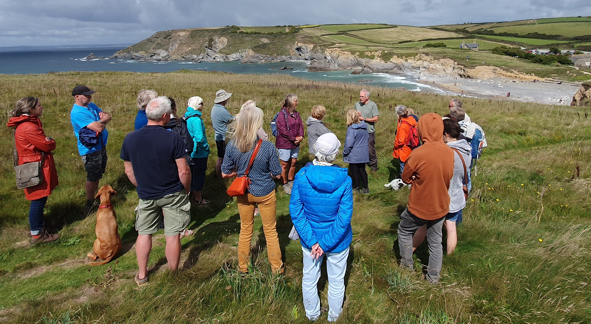
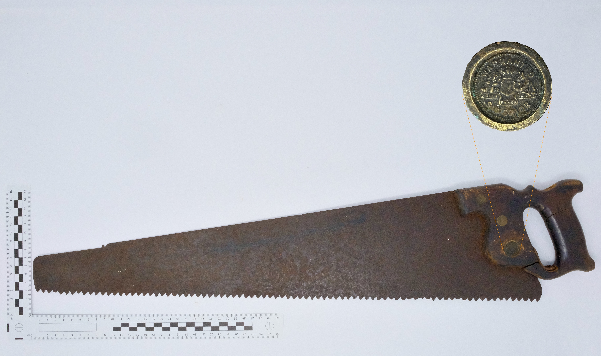
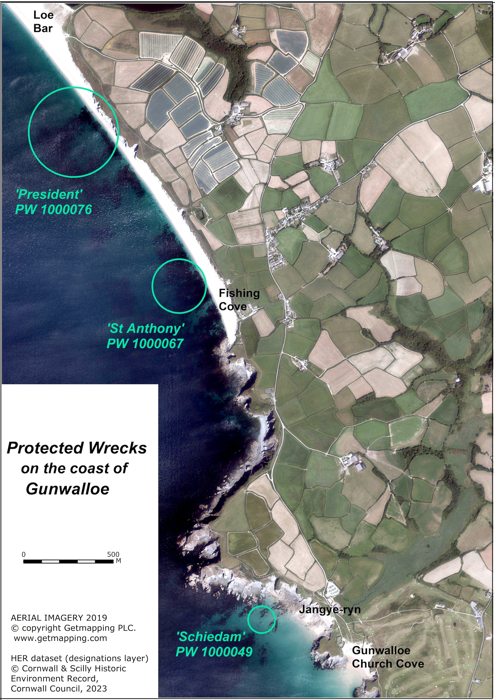

**Wreck & Rescue at Gunwalloe: [Protected Wrecks](protected-wrecks-at-gunwalloe.md) &#124; [Wreck-related remains](more-wreck-related-remains-gunwalloe.md) &#124; [Shipwreck rescue](shipwreck-rescue-at-gunwalloe.md) &#124; [3D models](3D-model-descriptions.md)**

# Exploring the legacy on land of shipwrecks on the west of the Lizard, on the 50th Anniversary of the ‘Protected Wrecks’ (PW) legislation that helps preserve our undersea heritage.
A project by [Cornwall Archaeological Unit](http://cau.org.uk), Funded by [Historic England](https://historicengland.org.uk).

This website presents our project commemorating 50 years of Protected Wrecks (PWs):
1. [Exploring Gunwalloe’s Three ‘Protected Wrecks’](protected-wrecks-at-gunwalloe.md); 
1. [Looking at More Wreck-Related Remains, from around Gunwalloe](more-wreck-related-remains-gunwalloe.md), from among the hundreds of other local shipwrecks and strandings; 
1. [Sharing the legacy of Rescue at Gunwalloe](shipwreck-rescue-at-gunwalloe.md), which was to save thousands of lives.

*Licenced diver John Mitchell marks the PW anniversary, at the site of the Schiedam wreck of 1684 off Gunwalloe; from a video courtesy of diver Sean Hester who filmed it.* [Watch the dive video](website-images/diving-the-schiedam-prize-jangye-ryn-gunwalloe.mp4) (10MB, MP4 - file will download)

Gunwalloe, west of the great Lizard head on the south coast of Cornwall, forms a lee shore to Mount’s Bay with its ancient seaborne trade. Its isolated church by the sea was part of a medieval settlement, recorded in Domesday Book in 1086. At least one tenement besides the manor farm still remained when survivors of the three wrecks here struggled ashore.     

These three shipwrecks are among the 60 or so, in Cornwall and England, designated as PWs for their heritage importance. They were lost in different tragic circumstances.

* The royal Portuguese ship St Anthony was wrecked, and half her people drowned, in 1527 at Porth Lingey. This was probably the ancient name of Fishing Cove. She carried a rich cargo, fiercely contested on the beach and later in the courts.
* The President was an East Indiaman sailing home from south Asia, with high value goods including spices and diamonds. She was driven ashore in 1684 near Loe Bar.
* The Schiedam, a Dutch ship captured by corsairs and then by the English, was also lost in 1684, driven in to Jangye-ryn. She carried a heavy load of guns and goods from the evacuation of Tangier. The ship’s company, around 130 people, managed to get to shore, and some of the cargo was salvaged at the time.

PWs were created from 1973, to save our rarest, most meaningful shipwrecks ─ normally out of sight, but rich in evidence of past events and lost ways of living and voyaging.

Like Listed Buildings on land, and Scheduled Monuments both on land and in the tidal zone, PWs help conserve our archaeological heritage in its place and context. Designated wrecks are protected by law from disturbance, dredging or dumping, and from diving or retrieval of material without licence.

Licenced divers’ reports, photos, and site plans greatly expand our knowledge of the wrecks. This is gradually unfolding as the beach material on the seabed shifts to reveal more remains, or as research contributes new understanding.

The project has involved re-discovering wreck finds and records, and related sites on land; 

*	Scanning related artefacts, and making a total of [33 virtual 3D models](models.md) of them, presented here on the website (by Tom Goskar).
*	Drone survey and Ground Penetrating Radar, for sites on land relating to wrecks; the drone survey producing a 3D model of the Gunwalloe headland (by SUMO).
*	Investigating the tradition that a screen in Gunwalloe Church, captured by the 3D modelling, came from the 1527 wreck (by Joanna Mattingly and John Allan).
*	Sharing discoveries and memories, as well as the results of the above, with local people, divers, archaeologists and visitors, through walks and talks, displays and informal presentations over two days at Gunwalloe Church (August 2023).
*	As part of the August 2023 event, looking at evidence, excavated previously, of earlier medieval life at Gunwalloe, buried under sand and exposed in cliffs near the Schiedam wreck (with Imogen Wood).
*	Producing a report to present the project and its results in a similar way to this website, with screenshots of the 3D models. The report can be accesses via the ADS (Archaeology Data Service) ‘OASIS’ system online, together with SUMO’s technical report on the GPR survey, and a compilation of drone processing data.

## Acknowledgements

‘**Wreck and Rescue at Gunwalloe**’ was commissioned and funded by [Historic England](https://historicengland.org.uk) (HE project no. 9155). The project was conceived and carried out by [Cornwall Archaeological Unit](http://cau.org.uk) (CAU), Cornwall Council. Within CAU, the project lead officer was Cathy Parkes.

CAU are very grateful for the support and help of the [British Button Society](https://www.britishbuttonsociety.com/); [Cornwall Archaeological Society](https://cornisharchaeology.org.uk); [CISMAS](https://cismas.org.uk) (Cornwall and Isles of Scilly Maritime Archaeology Society); Cury and Gunwalloe Parish; [Historic England](https://historicengland.org.uk); [Kresen Kernow](https://kresenkernow.org) (Redruth); [Meneage Archaeology Group](https://www.meneagearchaeologygroup.org); [Museum of Cornish Life](https://https://museumofcornishlife.co.uk); [National Maritime Museum](https://www.rmg.co.uk/national-maritime-museum), Greenwich; [National Trust](https://www.nationaltrust.org.uk); [Old Cornwall Society](https://kernowgoth.org); [Royal Cornwall Museum](https://www.royalcornwallmuseum.org.uk/); [Shipwreck Treasure Museum](https://shipwreckcharlestown.co.uk/) (Charlestown); [SUMO Ltd](https://www.sumoservices.com); and the [V&A](https://www.vam.ac.uk) (London).

Many thanks to the project team John Allan; Kevin Camidge; Robert Felce; Tasha Fullbrook; David Gibbins; Tom Goskar; Jo Mattingly; Imogen Wood and SUMO’s Simon Batsman, Richard Fleming, Adam Stanford, and Scott Williams.

And also to contributors and volunteers Lydia Allt; Sharon Austin; Isobel Bloomfield; David Clifton; David Dale; Sally Ealey; Graham Folkerd; Mary Ford; Barbara Gordon; Anne Green; Katrina Griffiths; Michael Hall; Phoebe Herring; Sean Hester; Charlie Johns; Kirstin Kennedy; Catherine Lee; Hefin Meara; the late Mark Milburn; John Mitchell; Janet Tanner Moody; Barry Mundy; Maureen Needham; Priscilla Oates and a three supporters from the local OCS; James Parry; Bev Payton; Jane Perry; Dixon Pickup; Debbie Purser; Anthony Randall; David Roberts; Adrian Rodda; Daniel Scholes; Rozanne Trudgeon; Ken Wallace, Louise Williams; and Neill Wood.

*SUMO drone survey capturing the Castle headland, at extra-low spring tide, 2023*

*Looking at the Schiedam PW site from the Castle, with Cathy Parkes (CAU), and David Gibbins and other divers, at the project event based at Gunwalloe Church in 2023.*

*Saw, with enlarged maker’s mark ‘Warren and Ted Superior’, preserved by coastguard Barry Mundy, salvaged from French steam collier ‘Denise’ in 1917. ‘Denise’ struck a few miles south of Gunwalloe at Men-te-Heul, meaning ‘High Rock’ as shown by the place-name work of Dr Oliver Padel. Coastal rocks, having been hazards and guides to navigation and fishing from ancient times, often have names in Kernewek, the Cornish language. Barry’s family had suffered a tragic shipwreck in 1872; William Mundy, coxswain of the Mullion lifeboat, two of his sons, and a friend, were lost when their fishing boat capsized. The Mundy family disaster and the stranding of the ‘Denise’ are among many local maritime incidents noted by Mullion historian Robert Felce.*

*Tom Goskar scanning a probable deck gun from the Schiedam found by Robert Felce, to make a virtual 3D model, June 2023*

*Aerial photo, showing the location of the 3 Protected Wrecks on the coast of the parish of Gunwalloe. On the south is the Castle headland with the Church behind it.*

**Wreck & Rescue at Gunwalloe: [Protected Wrecks](protected-wrecks-at-gunwalloe.md) &#124; [Wreck-related remains](more-wreck-related-remains-gunwalloe.md) &#124; [Shipwreck rescue](shipwreck-rescue-at-gunwalloe.md) &#124; [3D models](3D-model-descriptions.md)**

