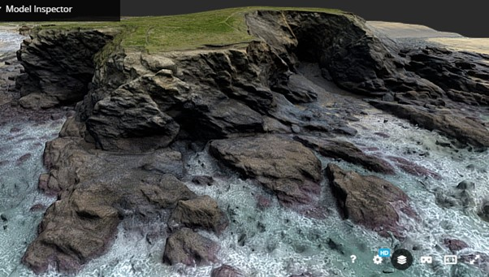
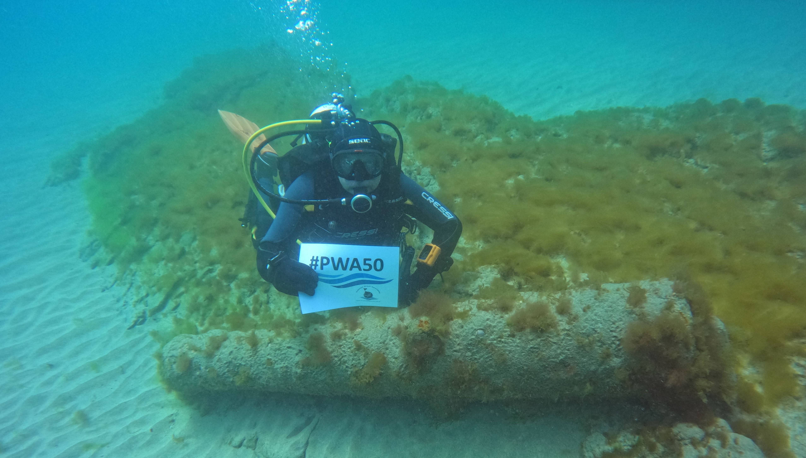

# Wreck and Rescue at Gunwalloe, Cornwall
## Exploring the legacy on land of shipwrecks on the west of the Lizard, on the 50th Anniversary of the ‘Protected Wrecks’ (PW) legislation that helps preserve our undersea heritage.
A project by [Cornwall Archaeological Unit](http://cau.org.uk), Funded by [Historic England](https://historicengland.org.uk).

This website presents our project commemorating 50 years of Protected Wrecks (PWs):
1. Exploring Gunwalloe’s Three ‘Protected Wrecks’; 
1. Looking at More Wreck-Related Remains, from around Gunwalloe, from among the hundreds of other local shipwrecks and strandings; 
1. Sharing the legacy of Rescue at Gunwalloe, which was to save thousands of lives.

Gunwalloe, west of the great Lizard head on the south coast of Cornwall, forms a lee shore to Mount’s Bay with its ancient seaborne trade. Its isolated church by the sea was part of a medieval settlement, recorded in Domesday Book in 1086. At least one tenement besides the manor farm still remained when survivors of the three wrecks here struggled ashore.     

These three shipwrecks are among the 60 or so, in Cornwall and England, designated as PWs for their heritage importance. They were lost in different tragic circumstances.

* The royal Portuguese ship St Anthony was wrecked, and half her people drowned, in 1527 at Porth Lingey. This was probably the ancient name of Fishing Cove. She carried a rich cargo, fiercely contested on the beach and later in the courts.
* The President was an East Indiaman sailing home from south Asia, with high value goods including spices and diamonds. She was driven ashore in 1684 near Loe Bar.
* The Schiedam, a Dutch ship captured by corsairs and then by the English, was also lost in 1684, driven in to Jangye-ryn. She carried a heavy load of guns and goods from the evacuation of Tangier. The ship’s company, around 130 people, managed to get to shore, and some of the cargo was salvaged at the time.

PWs were created from 1973, to save our rarest, most meaningful shipwrecks ─ normally out of sight, but rich in evidence of past events and lost ways of living and voyaging.

Like Listed Buildings on land, and Scheduled Monuments both on land and in the tidal zone, PWs help conserve our archaeological heritage in its place and context. Designated wrecks are protected by law from disturbance, dredging or dumping, and from diving or retrieval of material without licence.

Licenced divers’ reports, photos, and site plans greatly expand our knowledge of the wrecks. This is gradually unfolding as the beach material on the seabed shifts to reveal more remains, or as research contributes new understanding.

The project has involved re-discovering wreck finds and records, and related sites on land; 

*	Scanning related artefacts, and making virtual 3D models of them, presented here on the website (by Tom Goskar).
*	Drone survey and modelling, and Ground Penetrating Radar, to look for evidence of salvage works and other sites, on land, but relating to wrecks (by SUMO).
*	Investigating the tradition that a screen in Gunwalloe Church, captured by the 3D modelling, came from the 1527 wreck (by Joanna Mattingly and John Allan).
*	Sharing discoveries and memories, as well as the results of the above, with local people, divers, archaeologists and visitors, through walks and talks, displays and informal presentations over two days at Gunwalloe Church (August 2023).
*	As part of the August 2023 event, looking at evidence, excavated previously, of earlier medieval life at Gunwalloe, buried under sand and exposed in cliffs near the Schiedam wreck (with Imogen Wood).

Many thanks to the British Button Society, Cornwall Archaeological Society; CISMAS (Cornwall and Isles of Scilly Maritime Archaeology Society); Parish of Cury and Gunwalloe; Historic England; Meneage Archaeology Group; Museum of Cornish Life (Helston); National Maritime Museum, Greenwich; National Trust; Old Cornwall Society; Royal Cornwall Museum (Truro); Shipwreck Treasure Museum (Charlestown); SUMO Ltd and the V&A.

And also to John Allan; Kevin Camidge; Robert Felce; Tasha Fullbrook: David Gibbins; Tom Goskar; Katrina Griffiths; Sean Hester; Phoebe Herring; Jo Mattingly; the late Mark Milburn; John Mitchell; Janet Tanner Moody; Barry Mundy; Priscilla Oates; Debbie Purser; Anthony Randall; Louise Randall; Daniel Scholes; Imogen Wood and all project Volunteers.

*Fig 1.1: Screenshot of a 3D model showing Gunwalloe’s Castle head at low spring tide. The site is a Scheduled ‘cliff castle’ of the Iron Age. It has rare archaeology of wreck salvage too, on the eroding cliffs and tidal inlet at its outermost point.*

[View the 3D model on Sketchfab](https://#)

*Fig 1.2: Licenced diver John Mitchell marks the PW anniversary, at the site of the Schiedam wreck of 1684 off Gunwalloe; from a video courtesy of diver Sean Hester who filmed it.*

[Watch the dive video](https://#)

