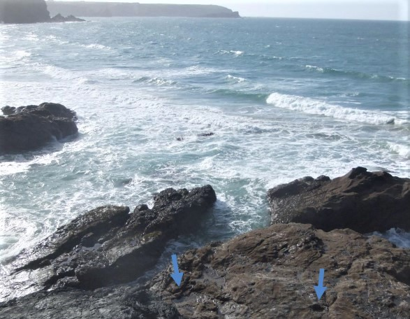
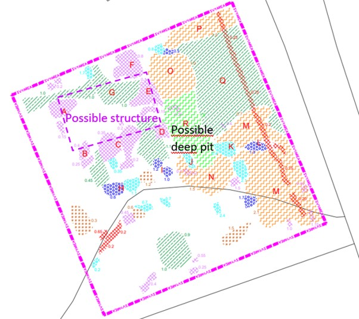
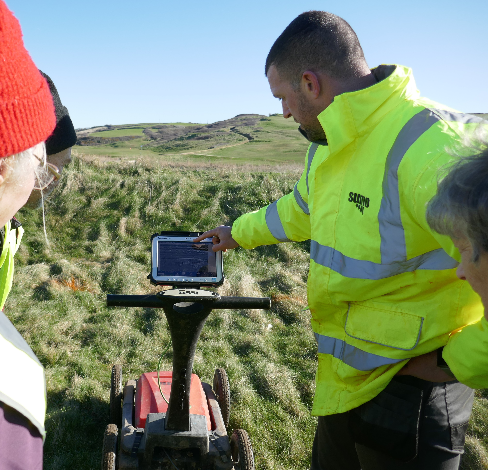

**Wreck & Rescue at Gunwalloe: [Home](index.md) | [Protected Wrecks](protected-wrecks-at-gunwalloe.md) | [Wreck-related remains](more-wreck-related-remains-gunwalloe.md) | [Shipwreck rescue](shipwreck-rescue-at-gunwalloe.md) | [3D models](3D-model-descriptions.md)**

# More Wreck-Related Remains, from around Gunwalloe

## ‘Dollar Wreck’; wrecked c1784, off the Castle headland, Gunwalloe

Silver dollars of c1784, attributed to a lost wreck, have been found here. A report of 1844 refers to 500, but this was stated to promote a salvage company, so may not be reliable! 
Several schemes followed, even as late as 1909, involving damming the inlet, and driving an adit to blow up the seabed and sift the debris, as well as diving. In 1877 a new company evoked a recent ‘gold rush’ ─ ‘Here we have a better thing even than Australia, with all its gold mines – money already coined for us, and therefore let us put it into our purses!’

A salvage way and other remains of these schemes are now inaccessible, due to cliff erosion, tidal action and sea-level rise. However, the rock-cut track especially is visible on the project’s drone survey of the Castle; together with the rampart of the Iron Age ‘cliff castle’ for which the headland is named, defined by a rampart on the landward side. 

## Low Lee Ledge; multiple wreck site, off Penlee Point, Penzance

As noted by Kevin Camidge of CISMAS, Low Lee, a steep reef just below the waves, has wrecked many ships. At least 3 post-date 1851 when it was marked by a buoy; the steel steamer *Primrose* sunk here in 1906. The site is complex, with remains including organic material like whale bone, as well as bricks and cannon balls, and varied marine life. A cannon recovered from the reef in 1916 stood at Penzance Public Library until stolen in 2003.

The ledge lies on the west side of Mount’s Bay, but gales could drive wreckage from here to Gunwalloe. On February 1st 1833, a buoy at the Runnel Stone on the far side of the bay was wrenched off its moorings, and swept to Gunwalloe with 15 fathoms of chain.

## Gunwalloe coves; other wreckage, recorded from medieval times

Wreck timber from Gunwalloe appears in Duchy accounts for 1297-98, a trace of the wrecks of medieval times when this was a manorial centre.  Crumbling cliffs have exposed remains of houses dating from before Domesday, partly excavated in 2011-2012 by a team led by Imogen Wood. The *‘Wreck and Rescue’* Ground Penetrating Radar (GPR) survey indicates potential remains of another building and a pit, deep under blown sand.

A memorial ‘book’ made of ship’s timber records the fatal *Santesta* wreck of 1865. A note in a bottle was brought to the Vicar in 1873; he made out the name *Zibriea* and ‘fearful storm’, and sent the message on to the Signal Station on the Lizard. Parish registers note strandings of drowned bodies; 36 in the early 19th century alone, among them a man with tattoos including three stars on his hands, found after the loss of a French coaster in 1817.

Robert Felce has recorded many other local wreck stories. He also reports finding a silver button at Church Cove, possibly from a wreck or wreck victim carried here by the waves.

## Heritage of other wrecks 

You can explore through ‘Wreck and Rescue’ 3D models:

* [The Castle, Gunwalloe](https://sketchfab.com/3d-models/gunwalloe-cove-txt-1c17c036feba4abdafee4931a1bcc87b); the headland at extra low tide, with salvage access way
* 1780s silver dollars ([model 1](https://sketchfab.com/3d-models/rcm-1780s-silver-dollar-from-a-gunwalloe-wreck-61fb2e109084482d8f50c3f8c8deea50), [model 2 - with concretion](https://sketchfab.com/3d-models/rcm-1780s-silver-dollar-with-concretion-68279aaa74a8458ebfc7d6dd0b9ce2ab); from [Royal Cornwall Museum](https://www.royalcornwallmuseum.org.uk), Truro
* Low Lee bowl, brick, deadeye, lid with shot hole (4 models); from CISMAS
* [Silver button](https://sketchfab.com/3d-models/silver-button-ffda97d5b1af4a9ab627955561548a4c); found by Robert Felce of Mullion
* ‘[Book](https://sketchfab.com/3d-models/carved-memorial-book-made-from-shipwrecked-wood-826764ec7bca42e187b823c9dd955d51)’ carved from shipwreck timber; from [Museum of Cornish Life](https://museumofcornishlife.co.uk), Helston

## Acknowledgements 

Sources of information used, which also give further details;

* Camidge, K, forthcoming. *Low Lee, Penzance*. CISMAS: Penzance
* Catalogue/display text: Museum of Cornish Life, Helston; Royal Cornwall Museum, Truro
* Cummings, AH, 1875. *Churches and Antiquities of Cury and Gunwalloe*. W Lake: Truro
* Felce, R, 2022. *Dodging about in the Mullion Roads*. Robert Felce: Mullion
* Kowaleski, M, (ed) 2001. *The Havener’s Accounts of the Earldom and Duchy of Cornwall, 1287-1356*. New Series, 44. Devon and Cornwall Record Society: Exeter
* Wood, I, 2015. *Gunwalloe Through The Ages: Middle Bronze Age to the 12th century AD Lizard Peninsula, Cornwall*. National Trust Penrose Estate: Helston

## Photographs

*Tidal rocks off the Castle head, Gunwalloe; with examples of the sockets for salvage dam works, now making square rockpools, marked by blue arrows.*

*‘Wreck and Rescue’ volunteers laying marks for the drone survey of the headland.*

*Plan of GPR survey area 20.75 square, north of Gunwalloe churchyard, indicating buried remains ─ a possible structure some 8m by 4m across, and a pit perhaps a wreck victims’ grave. Gunwalloe is a shrunken settlement; it was a manorial centre at Domesday (1086). Buried early houses like those found on the cliffs may extend to this area.*

*Study of estate records (Fox and Padel, 2000) shows at least one tenement, besides the manor farm which had several houses, remained in the period of Gunwalloe’s wrecks, now PWs. So perhaps there were tenants here to help survivors like those who, having lost all they owned, petitioned the King for help (on the Schiedam wreck page).*

*Ground Penetrating Radar (GPR) survey underway.*

**Wreck & Rescue at Gunwalloe: [Home](index.md) | [Protected Wrecks](protected-wrecks-at-gunwalloe.md) | [Wreck-related remains](more-wreck-related-remains-gunwalloe.md) | [Shipwreck rescue](shipwreck-rescue-at-gunwalloe.md) | [3D models](3D-model-descriptions.md)**
