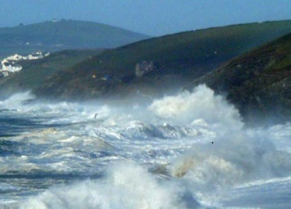

**Wreck & Rescue at Gunwalloe: [Protected Wrecks](protected-wrecks-at-gunwalloe.md) &#124; [Wreck-related remains](more-wreck-related-remains-gunwalloe.md) &#124; [Shipwreck rescue](shipwreck-rescue-at-gunwalloe.md) &#124; [3D models](3D-model-descriptions.md)**

# Gunwalloe’s Three ‘Protected Wrecks’

* *[St Anthony](#1-st-anthony-pw-1000067-portuguese-carrack-wrecked-1527-fishing-cove-gunwalloe)*
* *[Schiedam](#2-schiedam-pw-1000049-dutch-flute-wrecked-1684-jangye-ryn-gunwalloe)*
* *[President](#president-or-loe-bar-wreck-pw-1000076-english-east-indiaman-wrecked-1684-loe-bar)*, or ‘Loe Bar Wreck’

## 1 *St Anthony*, PW 1000067; Portuguese carrack, wrecked 1527, Fishing Cove, Gunwalloe

### The Site and its Discovery

Discoveries of copper ingots at Fishing Cove led to investigation by diver Michael Hall and maritime historian and diver Richard Larn. The site was identified as wreckage from the royal Portuguese ship *St Anthony*, and was designated a PW in 1982. The ship was wrecked and many of her people drowned in 1527, on route from Antwerp to Lisbon. She carried a rich cargo, contested in the courts after the wreck; a history revealed in 1968 by John Trenoweth, descendant of one of the officers dealing with the disputes at the time.

Through licensed diving and research on the PW by Anthony Randall in the mid-1980s, many artefacts were recovered and identified, including remarkable little lion-shaped supporters for the base of a splendid brass candlestick. 

No undisturbed remains of the ship itself are known. As recorded in 1527, the ship struck at Porth Lingey, or Hingey ─ Hingey is a nearby farm, site of an ancient hamlet. This is probably the old Cornish name for Fishing Cove, re-named in English when its seine fishery was established. The seabed here has been mostly buried in sand since 1988. Search of a 'new' area in 2007 found scattered traces, rather than a coherent wreck site.

### The Story of the Wreck

This wreck has rare detailed documentation due to the disputes over the salvage. *St Anthony* was a 3 or 4 masted ‘carrack’, flagship of a fleet commanded by Antonio Pacheo for John (Joao) III of Portugal. Besides the ingots there were jewels, suits of armour, cloth, linen, musical and navigational instruments, candlesticks, and artillery, with pitch, tar, and other goods. Cannon of bronze and iron were also aboard to arm the ship.

When the anchors snapped in a foul gale, on January 19th, the master deliberately made for Loe Bar beach, but the ship struck a hidden reef, turned broadside on to the waves, and was pounded to pieces. Forty-five men, half the crew, managed to reach the shore. Goods were salvaged by the survivors and local people, but were fiercely contested.

The Portuguese claimed that local gentry Godolphin, St Aubyn and Milliton robbed them violently, with drawn swords and armed retinues. The three Cornish lords maintained they were sent for to prevent embezzlement of goods, and negotiated and paid for the salvage rights. Enquiries followed, and the case went to the Court of the Star Chamber. Records of the ruling were lost in the Civil War, but John Trenoweth found that the Cornish lords gained greatly, while Henry VIII ensured some return of goods or their value to Portugal.

Salvage recorded later in the 16th century included bronze guns (two went to Pendennis Castle), and, 50 years after the wreck, a silver pipe and chain weighing 1lb. Tradition attributes to the wreck the wooden screen that once embellished Gunwalloe Church.

### Heritage of the *St Anthony*
You can explore through ‘Wreck and Rescue’ 3D models: 

* Painted panels, remnants of old screen; from Gunwalloe Church (2 models: [south door](https://sketchfab.com/3d-models/st-winwaloe-apostles-gunwalloe-south-door-3d21db1873554a149f290d8d0cb7fdba), [north door](https://sketchfab.com/3d-models/st-winwaloe-apostles-gunwalloe-north-door-a5a30d74d40543e4820672e9b5e092ce))
* ‘[Stink Pot](https://sketchfab.com/3d-models/rcm-stink-pot-from-the-st-anthony-bb8af360365b4b15a87703f04f5c3f8e)’ lead shot, candlestick base, and copper ingot; from Royal Cornwall Museum, Truro
* [Replica of silver ingot](https://sketchfab.com/3d-models/stm-replica-ingot-from-the-st-anthony-a47f60b397714f469e966381a1905078); from Shipwreck Treasure Museum, Charlestown ─ the original being at the British Museum, London

View [all 3D models from this project](3D-model-descriptions.md).

### Acknowledgements 

Sources of information used, which also give further details;
* Catalogue/display text: Royal Cornwall Museum, Truro; Shipwreck Treasure Museum, Charlestown
* Chynoweth, J, 1968. The Wreck of the St Anthony. Journal of the Royal Institution of Cornwall New Series **4**, 385-406
* Historic England designation description, Protected Wreck 1000067
* Historic England archive, Protected Wrecks licensed divers’ reports
* Randall, A, n.d. The Wreck of the St. Anthony, 1527. TS article

### Photographs

*Surf at Fishing Cove pounding over the remains of the ‘St Anthony’, shot by Anthony Randall who explored and researched the wreck some 50 years ago (~1973).*

*Cornish church historian Jo Mattingly at the project event in Gunwalloe Church. Jo is highlighting part of the church screen attributed to the St Anthony wreck, built into a door ─ with the help of a divers’ torch from Kevin Camidge of CISMAS.*

*Fellow church specialist John Allan of Exeter shares observations of marks where the Gunwalloe Church screen once stood. The screen may have been paid for by the extraordinary rich salvage from the 1527 wreck of the St Anthony.*

*Anthony Randall’s photo of an ornamental candlestick with lion supporters at the base, the lions closely resembling others he found at the wreck of the St Anthony.*

*Silver ingot with candlestick parts below it, and lead disc between those; found by diving on the St Anthony and photographed after landing by Anthony Randall. Anthony suggests the lead piece is a seal from one of the suits of armour listed in the cargo.*

## 2 *Schiedam*, PW 1000049; Dutch flute, wrecked 1684, Jangye-ryn, Gunwalloe

### The Site and its Discovery

Anthony Randall found nine iron guns at Jangye-ryn in 1971. Over the next decade, he dived here with a team, initially Roy Davis, Michael Hall, Richard Larn, Peter McBride, Kenneth Simpson, Michael Stevens and Ian Spooner. The wreck was identified, from the style of its guns, with the notorious loss of the English prize *Schiedam* sailing from Tangier.

The site was designated a PW in 1982. Licensed diving continued when the ever-shifting sand and gravel revealed the wreckage. In 1982, for example, divers could discern 3 guns. Two small excavations were made through loose material to reach the concreted remains, and several pewter artefacts were found. In 1983 even less was visible. In 1984, though, the team could see a dozen guns, and used a datum line, fixed daily among the gullies and reefs, to start measuring in these ‘landmarks’ of an ever-changing site.

Many artefacts have been recovered, among them cannons, pewter and copper kitchen ware, bronze castings, grenades, worked marble, and some timbers and other organic material preserved in sand. In 2026 licensed divers David Gibbins and the late Mark Milburn found 3 half-hundredweight bronze merchant’s weights, bearing the arms of Portugal, attributed to the Portuguese occupation of Tangier and dated to c1500. David recovered the weights in 2020 for conservation, publication and display (forthcoming).

### The Story of the Wreck 

*Schiedam* was a *fluyt* or merchantman of c400 tons from Hoorn in Holland. Sailing in the Mediterranean in 1683, she was seized by a Corsair frigate. Ten days later she was taken again, by the English ship, *James Galley*, whose captain was Sir Cloudesley Shovel (later wrecked and drowned on Scilly). The *James’* log, transcribed by Anthony Randall, notes ‘This morning about ½ an hour past 5 a Clocke, we see a Saile Bere N W b W off us….we ffetcht upon her hoping her to be a Priz ….at 11 a Clock we Came up with her it is a flyboat off 400 Tun: Callid ye Groette Scherdam van Horn….’ 

The English took their prize to Tangier, acquired by Charles II in 1661 but now being evacuated as indefensible. Samuel Pepys was there, making valuations for compensation purposes. *Schiedam* served as a water carrier, then sailed to England with material stripped from Tangier, and a large ship’s company, and horses. The heavy load may have been a factor when she struck at Gunwalloe on April 4th. Her people survived, but with much distress. A group of caulkers, petitioning the King for unpaid wages, had ‘lost their Clothes, Tools, and other things then on Board’. The horses sadly were lost too, with much cargo, although a Richard Sampson salvaged some gear and guns in the aftermath. 

### Heritage of the Schiedam 

You can explore through ‘Wreck and Rescue’ 3D models:

* [Timber](https://sketchfab.com/3d-models/ships-rib-from-the-wreck-of-the-schiedam-prize-0c2ea267de12447ea26e967ec22869ac), and [carved marble](https://sketchfab.com/3d-models/marble-fragment-from-the-schiedam-prize-wreck-523d2896ebeb4d98975570698b1f4a8c) (2 models); from Museum of Cornish Life, Helston
* [Lead weight](https://sketchfab.com/3d-models/stm-compass-weight-from-the-shiedam-prize-e2efd85ff41c4c758edf03e13858df87), [nested copper vessels](https://sketchfab.com/3d-models/schiedam-nested-copper-measuring-cups-66a4e964a8c543a594cccf0412945d1d), and [lead box](https://sketchfab.com/3d-models/schiedam-square-section-lead-pot-141cd3ee67644810b7ccb756e6cbe470) (3 models); from Shipwreck Treasure Museum, Charlestown
* [Stern gun](https://sketchfab.com/3d-models/stern-gun-possibly-from-the-schiedam-aa4bdeb014ed4fa89d4b56e351eb6afc), and [grenades](https://sketchfab.com/3d-models/post-medieval-grenade-with-wooden-powder-bung-f9911d9c056543b2bd6c0db15f995197) including [wooden bungs](https://sketchfab.com/3d-models/wooden-grenade-powder-bung-f29de47cad0249acae5736ae5cb4523d), in [concreted beach material](https://sketchfab.com/3d-models/bob-felce-heavily-concreted-grenade-4f8e3429541f4748847b6bae82968307) (4 models); from Robert Felce, Mullion

View [all 3D models from this project](3D-model-descriptions.md).

### Acknowledgements 

Sources of information used, which also give further details;

* Black, J, 2005. *Schiedam, The Lizard, Cornwall*. Wessex Archaeology: Salisbury
* Camidge, K, 2013. *Schiedam Prize Desk-Based Assessment*
* Catalogue/display text: Museum of Cornish Life, Helston; Royal Cornwall Museum, Truro; Shipwreck Treasure Museum, Charlestown
* Historic England designation description, Protected Wreck 1000049
* Historic England archive material, Protected Wrecks licensed divers’ reports
* Randall, A, 1984. Corsairs booty, Samuel Pepys and the last ship out of Tangier *Western Morning News*
* Copies/transcriptions of documents, and commentary, courtesy of Anthony Randall. 

### Photographs

*Anthony Randall’s record of the petition to the King from a Master Caulker, Henry Dale, one of the distressed survivors of the Schiedam, requesting payment of lost wages.*

*Rough sea on the Schiedam site; from licensed diver David Roberts’ 2009 report.*

*Schiedam Gun 1, one of a dozen cannon ‘landmarks’ on the wreck site, courtesy of the late Mark Milburn.*

*One of the Schiedam swivel guns with 50cm scale, courtesy of the late Mark Milburn.*

*Lead vessels from ‘Hollandia’ and 'Schiedam'. Photo courtesy of Anthony Randall.*

*Pewter plate with knife scoring as well as maker’s marks and crest. Photo courtesy of Anthony Randall.*

*Pewter plate with knife scoring as well as maker’s marks and crest. Photo courtesy of Anthony Randall.*

*Schiedam survey of 2004, produced 2005, by Wessex Archaeology; incorporating plans made by Anthony Randall in several phases (coloured).*

## *President*, or ‘Loe Bar Wreck’, PW 1000076; English East Indiaman, wrecked 1684, Loe Bar

### The Site and its Discovery

Scattered iron objects including guns and an anchor were found here in 1998. The cannon are of 17th century type, and the remains are attributed to the recorded loss on Loe Bar of the *President*, an English ‘East Indiaman’ or large 3-masted well-armed merchant ship designed for sailing to and from southern Asia. The President was built in 1671, and wrecked in 1684 on a homeward voyage. The site was Designated a PW in 1999, as a rare seventeenth-century Indiaman shipwreck. 

Another British East Indiaman, the *Trial*, lost in 1622 on an uncharted reef off the north coast of what is now Western Australia ─ then unknown to the English ─ is Australia’s oldest protected wreck.

The site is on the rocky seabed 10-11 metres deep, swept by surge from the offshore swell which shifts material away or covers it in sand and shingle up to 3 to 4 metres thick.

Nevertheless, notable finds include one of the guns discovered in 1998 which had a wooden tampion still in its muzzle. A deposit that seemed to have flowed over the rock between the guns was sampled, and found to contain manganese oxide, apparently derived from some source on the vessel. 

Smaller items are known to survive on site too, in gullies in the rock. In 2012, for example, licensed divers David Roberts, Des Glover and Chris Cattlin could see the ship’s sounding lead, wedged between rocks.

### The Story of the Wreck 

Documentary evidence shows that the *President* carried an extremely valuable cargo, including spices, indigo, 100 tons of pepper, and a small quantity of diamonds. It was stated that 'On the Sunday immediately following, in Sermon-Time, the People of the next Town first heard of the Wreck, whereupon with one consent they ran out from their Devotion to the Spoil, leaving the Parson to Preach to the bare Walls. The Company sent down several Persons to recover what they could; which was scarce enough to pay for their Journey. The vessel nevertheless was of very rich Lading, being modestly judged of no less than a hundred thousand pound Fraight; of the Companies; beside what belong'd to private Persons, with much Jewish Treasure of Pearl and Diamonds.’

This account mentions several customs relating to ships’ cargo and to wrecks. Crew and passengers would carry, for their own gain, goods sometimes of high value not included in cargo lists, about their person or in their quarters on board. And on the coast where wrecks occurred, most of the local population, or ‘country people’ as they were called in contemporary reports, would take part in salvaging and ‘cellaring’ (storing) goods. 

Local people might seize and conflict over wreckage; conceal and use cargo themselves; consume spoilable goods like oranges; and trade valuable finds away. This might be exaggerated, though, by owners and other parties, in the complex play of wreck rights and disputes. Local people also secured finds on behalf of owners’ agents, or gave them up in return for compensation. Moreover, they saved lives from wrecks, even at great risk or loss of their own. After seeing the deadly destruction in 1807 of *HMS Anson* also on Loe Bar, Henry Trengouse of Helston drove the invention of rescue equipment used into modern times to save thousands of lives around the coast.

### Heritage of the President 

You can explore through a ‘Wreck and Rescue’ 3D model:

* [Billet of dyewood](https://sketchfab.com/3d-models/dyewood-billet-from-the-wreck-of-the-president-b360861dbe214bfd8675f6cca6cb5f06); from [Shipwreck Treasure Museum](https://shipwreckcharlestown.co.uk), Charlestown

View [all 3D models from this project](3D-model-descriptions.md).

### Acknowledgements 

Sources of information used, which also give further details;

* Catalogue/display text: [Shipwreck Treasure Museum](https://shipwreckcharlestown.co.uk), Charlestown
* Historic England designation description, Protected Wreck 1000076
* Historic England archive material, Protected Wrecks licensed divers’ reports
* Shipwreck Databases webpage, [Western Australia Museum](https://museum.wa.gov.au).

### Photographs

*Swivel gun at the wreck of the President, c2011, in a 2012 dive report by licensee David Roberts. The Schiedam section above shows a photo of a similar gun recovered by divers, and one of the Schiedam 3D models is of a [concreted one from the beach](https://sketchfab.com/3d-models/stern-gun-possibly-from-the-schiedam-aa4bdeb014ed4fa89d4b56e351eb6afc) near that site.*

*Sounding lead of the President, 2012; David Roberts’ 2012 dive report.*

*President wreck site in rough wintry sea, 2012; David Roberts’ 2012 dive report.*

**Wreck & Rescue at Gunwalloe: [Protected Wrecks](protected-wrecks-at-gunwalloe.md) &#124; [Wreck-related remains](more-wreck-related-remains-gunwalloe.md) &#124; [Shipwreck rescue](shipwreck-rescue-at-gunwalloe.md) &#124; [3D models](3D-model-descriptions.md)**
