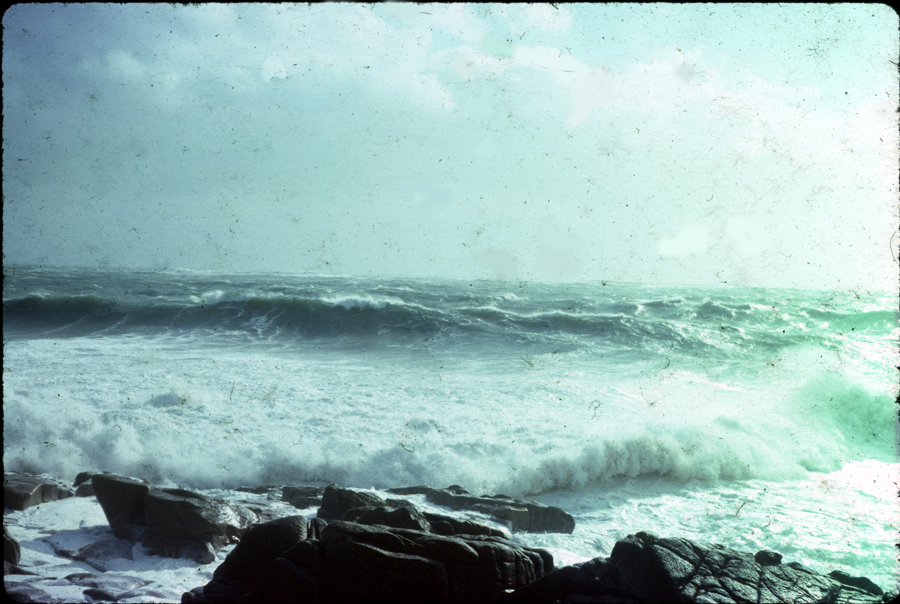

**Wreck & Rescue at Gunwalloe: [Protected Wrecks](protected-wrecks-at-gunwalloe.md) &#124; [Wreck-related remains](more-wreck-related-remains-gunwalloe.md) &#124; [Shipwreck rescue](shipwreck-rescue-at-gunwalloe.md) &#124; [3D models](3D-model-descriptions.md)**

# Shipwreck Rescue at Gunwalloe

## *James and Rebecca*; Government transport, wrecked 1807 at Halzephron, Gunwalloe

Edward Cornish of Gunwalloe, aged 19 or so, witnessed this fatal wreck, and described it in 1870, aged 82, to the parish historian Rev. Cummings. The ship was bringing dragoons home from Buenos Aries under General Whitelock, carrying some 180 people. 

Among the victims of the wreck were 28 horsemen, 10 crew, and 3 children; eight women were saved. As recalled also in 1870 by another witness consulted by the Vicar, Henry Cuttance of Gunwalloe, the drowned were buried in a single grave on Halzephron cliffs. 

## *HMS Anson*; wrecked 1807 on Loe Bar 

The 44-gun frigate *HMS Anson* sailed from Falmouth on Christmas Eve to the wars in France. She was driven back by gales, and two days later parted from her anchor off the Lizard. Captain Charles Lydiard, like Antonio Pacheo of the *St Anthony* in 1527, tried to run the *Anson* ashore on Loe Bar, but struck, broadside on. Around half the ship’s company escaped. Over 120 died, in sight of crowds on the bar striving but unable to help.

Portable salvage, like a copper bolt preserved at the [Museum of Cornish Life](https://museumofcornishlife.co.uk) in Helston, may have helped draw people to the beach who then risked or even tragically lost their lives in rescue attempts. Divers have since raised larger remains, including a cannon also displayed at the museum.

Such appalling loss of life, in two wrecks at Gunwalloe in one year, led to a change in the law. At that time bodies from the sea were interred where they came ashore. An Act of 1808, promoted by Helston MP Davies Gilbert, sanctioned burial in churchyards.

## Invention of the rocket line; Henry Trengrouse of Helston (1772-1854) 

In a notebook, preserved at the Kresen Kernow archive, Redruth, Trengrouse recorded his distress at the *HMS Anson* disaster, referring also to the *James and Rebecca* wreck ─   
‘stranded within the small distance of sixty yards of numerous persons assembled on the beach, who afforded all the assistance in their power; yet the commander with upwards of one hundred other officers and men were drowned….[and the] destruction of about fifty fine fellows at the wreck of a transport only a few weeks preceding….’

Trengrouse’s book advocates his (literally) explosive invention, a compact portable ‘Rocket Apparatus’ to fire a line to the ship from the shore or a rescue boat. With this he describes a ‘Sailors Life Spencer’ or life jacket; a ‘Safety Chaise’ or Bosun’s Chair to carry people to shore hanging from the ‘travelling’ rope fixed on the ship; and other equipment.

Maurice Smelt notes that Alexander I of Russia sent Trengrouse a diamond ring, and the Royal Society of Arts gave him a silver medal. His apparatus was officially adopted, albeit slowly. In just in 16 years, 1881 to 1897, it had already saved around 5,000 lives.

## Heritage of Rescue at Gunwalloe 

You can explore through ‘Wreck and Rescue’ 3D models:

* *HMS Anson* [gun](https://sketchfab.com/3d-models/cannon-from-hms-anson-4968ee81b5f04c388129c758b05a94dd), and [bolt](https://sketchfab.com/3d-models/clench-bolt-from-hms-anson-7cee3c157fac4ec3a5c6b5af998c5e25) (2 models); from Museum of Cornish Life, Helston
* Life-saving gear developed by Henry Trengrouse – [Rocket line](https://sketchfab.com/3d-models/rescue-apparatus-coiled-rocket-line-08cb44f703904e9f8a6717502e142b48); [Line ‘former’ for stowage](https://sketchfab.com/3d-models/rescue-apparatus-rocket-line-former-a162873a58a7446cab8094287f79ebd2); [Bosun’s chair](https://sketchfab.com/3d-models/trengrouses-bosuns-chair-d8aa65895b044bc3994342badecbdd35); [Breeches buoy](https://sketchfab.com/3d-models/breeches-buoy-56ebae3995f84ecc9ceb4fb5698d052d); [Lifejacket](https://sketchfab.com/3d-models/trengrouses-life-spencer-early-life-jacket-ce46b9e728bf4833b0659c7236356677); and [gig of the kind fitted with rocket](https://sketchfab.com/3d-models/pilot-gig-model-6fe215051223473ba31824d3de0ac091); (6 models) from Museum of Cornish Life, Helston
* [Modern lifeboat](https://sketchfab.com/3d-models/model-of-the-lizard-lifeboat-rnlb-duke-of-york-8619d5cb78964887bd31e0953f7dfd11); from Museum of Cornish Life, Helston

View [all 3D models from this project](3D-model-descriptions.md).

## Acknowledgements 

Sources of information used, which also give further details;

* Bray, J, 1975. *An Account of Wrecks 1759-1830*. Institute of Cornish Studies: Redruth 
* Catalogue/display descriptions: Museum of Cornish Life, Helston
* Cummings, AH, 1875. *Churches and Antiquities of Cury and Gunwalloe*. W Lake: Truro
* Larn, R, and Carter, C, 1969. *Cornish Shipwrecks The South Coast*. David and Charles: Newton Abbot
* Parkes, C, 2017. *Lizard Point, Landewednack, Cornwall: Archaeological Assessment*. Report no. 2017R007 CAU: Truro
* Smelt, M, 2006. *101 Cornish Lives.* Alison Hodge: Penzance

## Photographs

*Rough seas near the Schiedam site at Jangye-ryn, around the time the 3 wrecks were protected here at Gunwalloe, some 40 years ago; photo courtesy Anthony Randall.*

*Slippen and Bonnet, built in the early 19th century, are among the historic gigs on the Isles of Scilly still rowed today (pictured at a heritage gig event in 2021). These boats were used for rescue and salvage, as well as pilot work, for over a hundred years.*

*Memorial in Gunwalloe churchyard, to Joseph Dale, who was drowned aged 22 while rescuing a sailor from the wreck of the Herman and August on Loe Bar in 1808. Joseph had helped save lives the previous year from the wreck of the James and Rebecca, one of the disasters cited by Henry Trengrouse as driving his inventing of rescue apparatus.*

*A crew member being winched from the City of Cardiff (1909) in a breeches buoy. Photograph by Gibson, Penzance. Copyright National Maritime Museum, Greenwich, London*

**Wreck & Rescue at Gunwalloe: [Protected Wrecks](protected-wrecks-at-gunwalloe.md) &#124; [Wreck-related remains](more-wreck-related-remains-gunwalloe.md) &#124; [Shipwreck rescue](shipwreck-rescue-at-gunwalloe.md) &#124; [3D models](3D-model-descriptions.md)**
